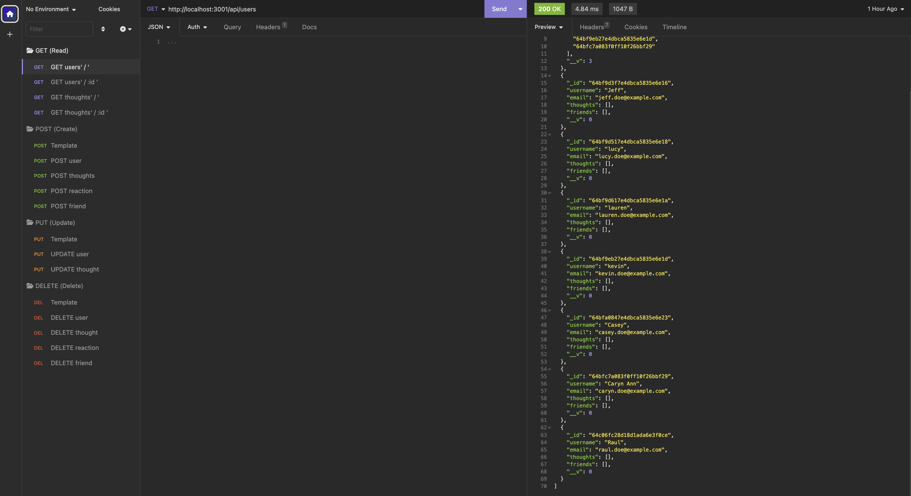

# 18-NoSQL

## License
&nbsp;

* Select the badge to see details.
* To see more about license badges, visit [Shields IO](https://shields.io/category/license)

&nbsp;

## Description
Social media startups want an API for their social network that uses a NoSQL database. The goal is for their websites to handle large amounts of unstructured data. This enables fast and efficient processing of API GET, POST, PUT, and DELETE data routes. This repo shows Insomnia testing of routes and how data can quickly and successfully be updated in the database.

&nbsp;

## Table of Contents

 * [Installation](#installation)
 * [Usage](#usage)
 * [Media](#media)
 * [Testing](#testing)
 * [Contribution](#contribution)
 

&nbsp;

## Installation

There are several steps involved. The most important are to make sure you establish reliable and smooth flowing access to your NoSQL account as well as the abiltiy to quickly and easily open a local port on your PC in order to use Insomnia for effective testing.

1. Make sure you have [Node.js](https://nodejs.org/en) installed.
2. Make sure you have [MongoDB Compass](https://www.mongodb.com/try/download/compass) installed.
3. Clone this repo to your machine.
4. Install the following NPM modules on your root directory:
     * express: 4.18.2
     * mongoose: 7.0.2
5. Open package.json and enter "initialize": "npm -s i && npm run -s seed && npm -s start" as a script.
     * This will run 3 separate functions, one after the other in order to install dependencies, seed the database as well as open the port on your PC and start the server.
6. Open the MongoDB App and select the connect button.
7. Open a terminal on the server.js file and type in 'npm run initialize' on the command line.
8. You will now be ready to use [Insomnia](https://insomnia.rest/download) to test API routes you have created.
9. There is a video link below to give you an overview how Insomnia works in testing API routes.

&nbsp;

[Table of Contents](#table-of-contents)

## Usage

See the video

&nbsp;

[Table of Contents](#table-of-contents)

## Media
_A snapshot of the Insomnia build_
&nbsp;

* Visit [Full Media](https://drive.google.com/file/d/1DkHJtfiQkxQ5bsglmH0z2loxhrPzHSFu/view?usp=drive_link) to see an entire video showing functionality.

&nbsp;

[Table of Contents](#table-of-contents)

## Testing

Testing of these APIs or one that you create can be done through Insomnia or Postman.

&nbsp;

[Table of Contents](#table-of-contents)

## Contribution

&nbsp;

[Table of Contents](#table-of-contents)

## Questions

_If you have any questions, please feel free to contact me._

GitHub Username: [waynefenwick](https://github.com/waynefenwick)

Email Address: <a href="mailto:waynefenwick@gmail.com">waynefenwick@gmail.com</a>

&nbsp;

_Thanks for taking time to visit this repository!_

[Back to Top](#)

